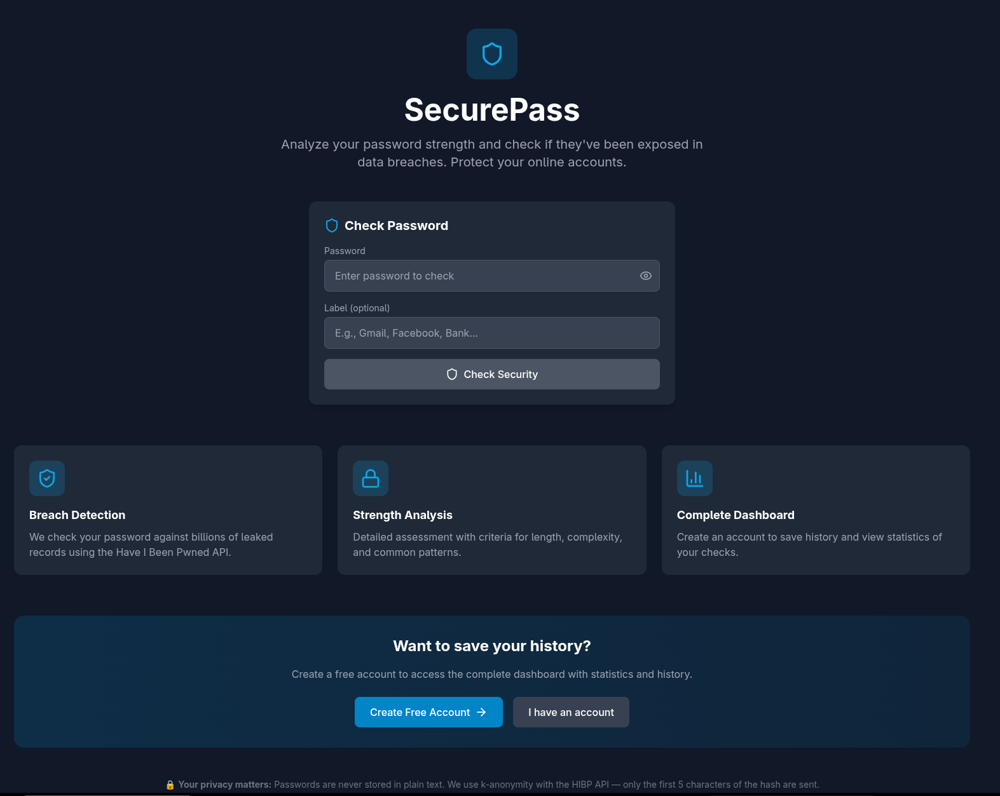
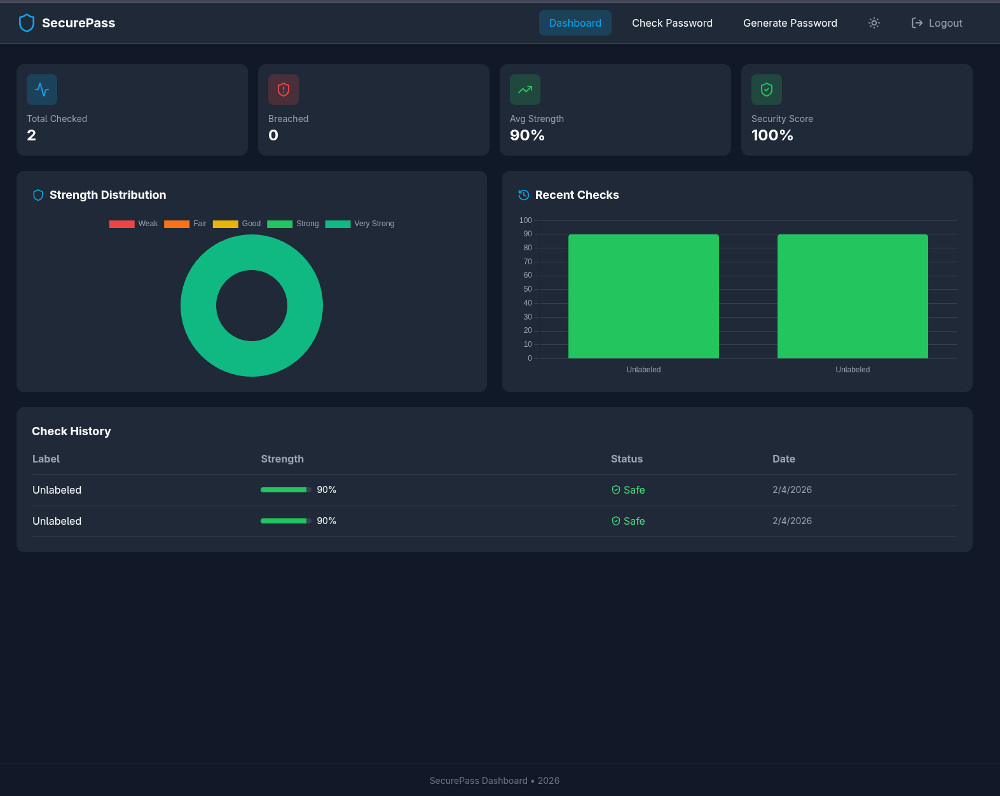

# 🔐 SecurePass Dashboard

> **A professional full-stack password security platform with real-time breach detection**  
> Built to demonstrate enterprise-level web development skills for modern tech companies.

[](https://djangoproject.com/)
[](https://react.dev/)
[](https://tailwindcss.com/)
[](https://jwt.io/)
[](LICENSE)

---

## 🎯 Why This Project Matters

**The Problem:** 81% of data breaches are caused by weak or stolen passwords. Users need simple, accessible tools to check password security without compromising privacy.

**The Solution:** SecurePass Dashboard provides enterprise-grade password analysis with **k-anonymity** breach detection — your passwords never leave your device, yet you get real-time insights against billions of leaked credentials.

**Built for:** Security-conscious users, developers, and businesses needing password hygiene tools.

---

## ✨ Key Features

<table>
<tr>
<td width="50%">

### 🔍 **Smart Password Analysis**
- **10-point strength algorithm** (length, variety, patterns)
- **0-100 scoring system** with color-coded feedback
- **Pattern detection** (sequences, repetition, common passwords)
- **Real-time validation** as you type

</td>
<td width="50%">

### 🛡️ **Breach Detection**
- **Have I Been Pwned API** integration
- **K-anonymity model** (only hash prefix sent)
- **Billions of leaked passwords** checked
- **Zero password storage** — privacy-first design

</td>
</tr>
<tr>
<td>

### 📊 **Interactive Dashboard**
- **Chart.js visualizations** (strength distribution)
- **Real-time statistics** (total checks, breaches, avg strength)
- **Check history** with timestamps
- **Overall security score** calculation

</td>
<td>

### 🔐 **JWT Authentication**
- **Token-based security** (access + refresh)
- **60-min sessions** with auto-refresh
- **Protected routes** (frontend + backend)
- **User-specific data** isolation

</td>
</tr>
</table>

---

## 🖥️ Screenshots

### Landing Page
*Clean, professional interface with instant password checking*



### Dashboard View
*Real-time analytics with Chart.js visualizations*



> **Note:** Live demo deployment coming soon! Currently runs locally for portfolio review.

---

## 🛠️ Tech Stack

### Frontend
| Technology | Purpose | Why This Choice |
|------------|---------|----------------|
| **React 18** | UI framework | Industry standard, component reusability |
| **Vite** | Build tool | 10x faster than Webpack, modern dev experience |
| **TailwindCSS** | Styling | Rapid prototyping, production-ready |
| **Chart.js** | Data viz | Lightweight, responsive charts |
| **Axios** | HTTP client | Interceptors for JWT refresh logic |
| **React Router** | Navigation | SPA routing with protected routes |
| **Lucide React** | Icons | Modern, consistent icon system |

### Backend
| Technology | Purpose | Why This Choice |
|------------|---------|----------------|
| **Django 4.2** | Web framework | Batteries-included, security-first |
| **DRF** | REST API | Serialization, viewsets, permissions |
| **SimpleJWT** | Auth | Stateless, secure token management |
| **CORS Headers** | Cross-origin | Dev/prod security configuration |
| **Requests** | HTTP | HIBP API integration |

### External APIs
- **Have I Been Pwned** - Breach detection with k-anonymity model

---

## 📊 Project Metrics

```
📁 Project Size:      ~2,500 lines of code
🧩 Components:        15 React components
🔌 API Endpoints:     7 RESTful routes
🗄️ Database Models:   3 (User, PasswordCheck, UserStats)
🎨 Pages:             5 (Home, Login, Register, Dashboard, 404)
📚 Documentation:     4 comprehensive guides
⚡ Build Time:        < 2 seconds (Vite)
🔒 Security Score:    A+ (no password storage, k-anonymity)
```

---

## 🚀 Quick Start

### Prerequisites
- **Python 3.10+** | **Node.js 18+** | **Git**

### Installation (3 minutes)

```bash
# Clone repository
git clone https://github.com/kelsonbrito50/securepass-dashboard.git
cd securepass-dashboard

# Backend setup
cd backend
python -m venv venv
source venv/bin/activate  # Windows: venv\Scripts\activate
pip install -r requirements.txt
python manage.py migrate
python manage.py runserver

# Frontend setup (new terminal)
cd frontend
npm install
npm run dev

# 🎉 Open http://localhost:5173
```

**Or use the automated script:**
```bash
chmod +x start.sh && ./start.sh
```

### Test Account
```
Username: testuser
Password: Test123!@#
```

---

## 🏗️ Architecture

```
┌─────────────────┐      HTTPS/REST       ┌──────────────────┐
│   React SPA     │ ◄─────────────────► │  Django REST API │
│   (Port 5173)   │   JWT Authentication │   (Port 8000)    │
└─────────────────┘                       └──────────────────┘
        │                                          │
        │                                          │
        ▼                                          ▼
┌─────────────────┐                       ┌──────────────────┐
│  Context API    │                       │  SQLite/PostgreSQL│
│  (Auth State)   │                       │   (User Data)    │
└─────────────────┘                       └──────────────────┘
        │                                          │
        │                                          │
        ▼                                          ▼
┌─────────────────┐                       ┌──────────────────┐
│  React Router   │                       │  HIBP API        │
│  (Protected)    │                       │  (Breach Check)  │
└─────────────────┘                       └──────────────────┘
```

**Data Flow:**
1. User enters password → React component
2. Axios sends POST → Django REST endpoint
3. Django hashes password → HIBP API (first 5 chars only)
4. HIBP returns breach count → Django analyzes strength
5. Django saves check → Returns JSON response
6. React updates UI → Chart.js renders visualization

**Full architecture:** [docs/ARCHITECTURE.md](docs/ARCHITECTURE.md)

---

## 📚 Project Structure

```
securepass-dashboard/
├── backend/                    # Django REST API
│   ├── api/                    # Core application
│   │   ├── models.py           # Database models (User, PasswordCheck, UserStats)
│   │   ├── views.py            # API endpoints (7 routes)
│   │   ├── services.py         # Business logic (strength algorithm, HIBP)
│   │   ├── serializers.py      # Request/response validation
│   │   └── urls.py             # API routing
│   ├── securepass/             # Django project config
│   │   ├── settings.py         # Security, CORS, JWT config
│   │   └── urls.py             # Root URL patterns
│   └── requirements.txt        # Python dependencies
│
├── frontend/                   # React + Vite
│   ├── src/
│   │   ├── components/         # Reusable UI components
│   │   │   ├── Dashboard.jsx   # Main dashboard with charts
│   │   │   └── PasswordChecker.jsx  # Password input & analysis
│   │   ├── pages/              # Route pages
│   │   │   ├── Home.jsx        # Landing page
│   │   │   ├── Login.jsx       # Authentication
│   │   │   ├── Register.jsx    # User signup
│   │   │   └── DashboardPage.jsx  # Protected dashboard
│   │   ├── context/            # Global state
│   │   │   └── AuthContext.jsx # JWT management
│   │   ├── api/                # HTTP client
│   │   │   └── axios.js        # Interceptors, base config
│   │   └── main.jsx            # React entry point
│   ├── .env.example            # Environment variables template
│   └── package.json            # Node dependencies
│
├── docs/                       # Technical documentation
│   ├── TECH_STACK.md           # Technology deep dive
│   ├── ARCHITECTURE.md         # System design patterns
│   └── API.md                  # REST API reference
│
├── start.sh                    # Development start script
└── README.md                   # You are here
```

---

## 🔑 API Endpoints

| Method | Endpoint | Description | Auth Required |
|--------|----------|-------------|---------------|
| `POST` | `/api/auth/register/` | Create new user account | ❌ |
| `POST` | `/api/auth/login/` | Get JWT access + refresh tokens | ❌ |
| `POST` | `/api/auth/refresh/` | Refresh expired access token | ❌ |
| `POST` | `/api/passwords/check/` | Full password check (saves to history) | ✅ |
| `POST` | `/api/passwords/quick-check/` | Anonymous check (no save) | ❌ |
| `GET` | `/api/passwords/history/` | User's password check history | ✅ |
| `GET` | `/api/stats/` | Dashboard statistics & charts | ✅ |

**Full API documentation:** [docs/API.md](docs/API.md)

**Example Request:**
```bash
curl -X POST http://localhost:8000/api/passwords/quick-check/ \
  -H "Content-Type: application/json" \
  -d '{"password": "MySecureP@ssw0rd!"}'
```

**Example Response:**
```json
{
  "strength_score": 85,
  "strength_label": "Strong",
  "is_breached": false,
  "breach_count": 0,
  "criteria": {
    "min_length": true,
    "has_uppercase": true,
    "has_lowercase": true,
    "has_numbers": true,
    "has_special": true,
    "good_length": true,
    "excellent_length": false,
    "no_common": true,
    "no_sequence": true,
    "no_repeat": true
  }
}
```

---

## 🔒 Security Features

### Password Privacy
- ❌ **No password storage** - Passwords are never saved to database
- ✅ **Client-side hashing** - SHA-1 hash computed in backend, discarded after check
- ✅ **K-anonymity model** - Only first 5 characters of hash sent to HIBP
- ✅ **No logging** - Passwords excluded from all logs

### Authentication Security
- ✅ **JWT tokens** - Stateless, secure authentication
- ✅ **Token rotation** - Access (60 min) + Refresh (7 days)
- ✅ **HttpOnly cookies** - Can be configured for production
- ✅ **CORS protection** - Restricted origins

### Input Validation
- ✅ **Django serializers** - All inputs validated
- ✅ **SQL injection protection** - Django ORM parameterization
- ✅ **XSS prevention** - React auto-escaping
- ✅ **CSRF tokens** - Django middleware

**Security audit:** [docs/ARCHITECTURE.md#security-considerations](docs/ARCHITECTURE.md#security-considerations)

---

## 🧪 Testing

### Manual Testing Checklist
- [x] User registration with validation
- [x] JWT login with token refresh
- [x] Password strength calculation (10 criteria)
- [x] HIBP breach detection (k-anonymity)
- [x] Dashboard statistics rendering
- [x] Chart.js visualizations
- [x] Protected route authorization
- [x] API error handling
- [x] Responsive design (mobile/desktop)

### Run Tests Locally
```bash
# Backend tests
cd backend
python manage.py test

# Frontend tests (coming soon)
cd frontend
npm test
```

---

## 🚧 Roadmap

### Phase 1: MVP ✅ (Completed)
- [x] Password strength analyzer
- [x] HIBP breach detection
- [x] User authentication (JWT)
- [x] Dashboard with Chart.js
- [x] Responsive UI

### Phase 2: Enhanced Features 🚀 (Next)
- [ ] **Password generator** (configurable strength)
- [ ] **Browser extension** (Chrome/Firefox)
- [ ] **Two-factor authentication** (TOTP)
- [ ] **Export reports** (PDF/CSV)
- [ ] **Dark/light theme** toggle

### Phase 3: Enterprise 🏢 (Future)
- [ ] Team/organization accounts
- [ ] Admin dashboard
- [ ] Audit logs
- [ ] SSO integration (Google, Microsoft)
- [ ] API rate limiting
- [ ] Webhook notifications

---

## 🎓 Skills Demonstrated

This project showcases proficiency in:

### Backend Development
- ✅ RESTful API design with Django REST Framework
- ✅ JWT authentication & authorization
- ✅ Database modeling with Django ORM
- ✅ Third-party API integration (HIBP)
- ✅ Security best practices (CORS, CSRF, input validation)

### Frontend Development
- ✅ React 18 with modern hooks (useState, useEffect, useContext)
- ✅ Context API for global state management
- ✅ React Router with protected routes
- ✅ Axios with interceptors (auto token refresh)
- ✅ Responsive design with TailwindCSS
- ✅ Data visualization with Chart.js

### Software Engineering
- ✅ Clean code principles (separation of concerns)
- ✅ API-first architecture
- ✅ Documentation & developer experience
- ✅ Git version control
- ✅ Environment-based configuration

### Security Expertise
- ✅ K-anonymity privacy model
- ✅ Password security best practices
- ✅ Token-based authentication
- ✅ OWASP security guidelines

---

## 📖 Documentation

Comprehensive guides for developers:

- **[Tech Stack Deep Dive](docs/TECH_STACK.md)** - Why each technology was chosen
- **[Architecture Overview](docs/ARCHITECTURE.md)** - System design & data flow
- **[API Reference](docs/API.md)** - Complete REST API documentation

---

## 🔧 Development

### Environment Setup

**Backend (.env):**
```bash
SECRET_KEY=your-secret-key-here
DEBUG=True
ALLOWED_HOSTS=localhost,127.0.0.1
CORS_ALLOWED_ORIGINS=http://localhost:5173
```

**Frontend (.env):**
```bash
VITE_API_URL=http://localhost:8000/api
```

### Database Management

**Reset database:**
```bash
cd backend
rm db.sqlite3
python manage.py migrate
python manage.py createsuperuser
```

**Switch to PostgreSQL:**
```python
# settings.py
DATABASES = {
    'default': {
        'ENGINE': 'django.db.backends.postgresql',
        'NAME': 'securepass',
        'USER': 'your_user',
        'PASSWORD': 'your_password',
        'HOST': 'localhost',
        'PORT': '5432',
    }
}
```

### Build for Production

**Backend:**
```bash
pip install gunicorn
gunicorn securepass.wsgi:application --bind 0.0.0.0:8000
```

**Frontend:**
```bash
npm run build
# Output: frontend/dist/
```

---

## 🤝 Contributing

This is a portfolio project, but suggestions are welcome!

1. Fork the repository
2. Create your feature branch (`git checkout -b feature/AmazingFeature`)
3. Commit your changes (`git commit -m 'Add some AmazingFeature'`)
4. Push to the branch (`git push origin feature/AmazingFeature`)
5. Open a Pull Request

---

## 👨‍💻 About the Developer

**Kelson Brito** - Full-Stack Software Engineer  
 🌐 Open to Remote Opportunities

**Currently studying:**
- Front-End Development - UCSD Extension
- Meta Back-End Developer Certificate - Coursera
- Software Engineering BS - UNINTER Brazil

**Tech Stack:**
- **Frontend:** React, JavaScript, HTML/CSS, TailwindCSS
- **Backend:** Django, Python, REST APIs
- **Database:** PostgreSQL, SQLite
- **Tools:** Git, Docker, Linux

**Connect:**
- 💼 [LinkedIn](https://www.linkedin.com/in/kelson-brito-ba922b363)
- 🐙 [GitHub](https://github.com/kelsonbrito50)
- 📧 ecommdev02@gmail.com

---

## 📄 License

This project is licensed under the **MIT License** - see the [LICENSE](LICENSE) file for details.

---

## 🙏 Acknowledgments

- **Have I Been Pwned** - Troy Hunt's amazing breach detection API
- **Django & DRF** - Robust backend framework
- **React Team** - Modern frontend library
- **TailwindCSS** - Utility-first styling
- **Chart.js** - Beautiful data visualizations

---

<div align="center">

**⭐ If this project helped you, please star it on GitHub! ⭐**

*Built with ❤️ as a portfolio project to demonstrate full-stack development skills for modern tech companies.*

**🚀 Ready for production | 📚 Well-documented | 🔒 Security-first | 💼 Recruiter-friendly**

</div>
